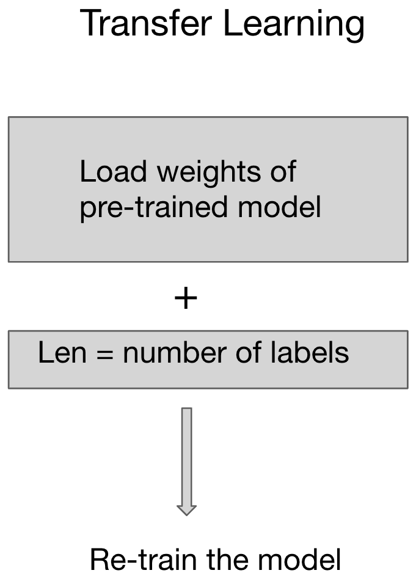

# NER data labeling tool
This model labels the data using BERT pretrained model.
Demo at http://quantanalytics.tech/
# Setting up python environment 

pip install -r requirements.txt

# Train model 
python model/train_model.py

#For inference
python app.py

# Introduction

Labelled data is crucial for any machine learning model. To get the machine learnig data companies uses Excel sheet to maintain the labels of data. This project has done with datasaur.ai for labeling data tool. datasaur.ai develops a software to label the data efficiently. 

For NER model, here I have used the BERT pretrained model for text classification.  To learn new labels Transfer Learnig has applied. Here I have loaded the weight of pretrained model then a new layer has been added for classification. The weight are update by calculating the gradient of binary cross entropy loss. I have used Linear Schedueler to make learning faster compared to constant linear rate. Figure shows the systematic diagram for transfer learning. 

Model has been build in Pytorch and trained on GPUs. This model has also been deployed on AWS.

 
# Procedure

Here I have used the publically avaialble corpus <a href="https://www.kaggle.com/abhinavwalia95/entity-annotated-corpus">data</a>. This data has tagged using BIO format. From this data I have extracted sentences and labels of each word in sentence using "model/sentence_retriever.py". As a next step each word in sentence is tokenized using BertTokenizer from transformers libarary. This tokenizes the each word. If word is not in dictionary it will divide the word in to muliple word followed by ##, to make the labels corresponding to each divided word, labels list is also extended. 
Furthermore each tokenized word is coverted to ids using convert_tokens_to_ids from BertTokenzer library. Each sentence is converted to MAX_LEN list. If sentence is less than MAX_LEN, it is masked with 0s if it is higher it is cropped. Simillary labels for each token is padded/truncated. 

To train the ML model, BertforTokenClassification weights are loaded and a new classification layer of length equals to number of labels is added. Weights been modified at each epochs using backward propogation.  
